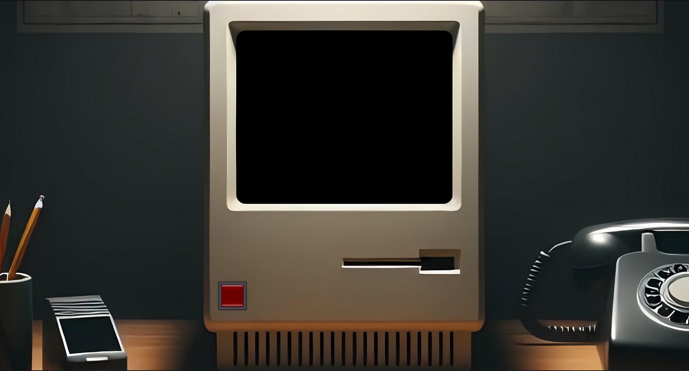
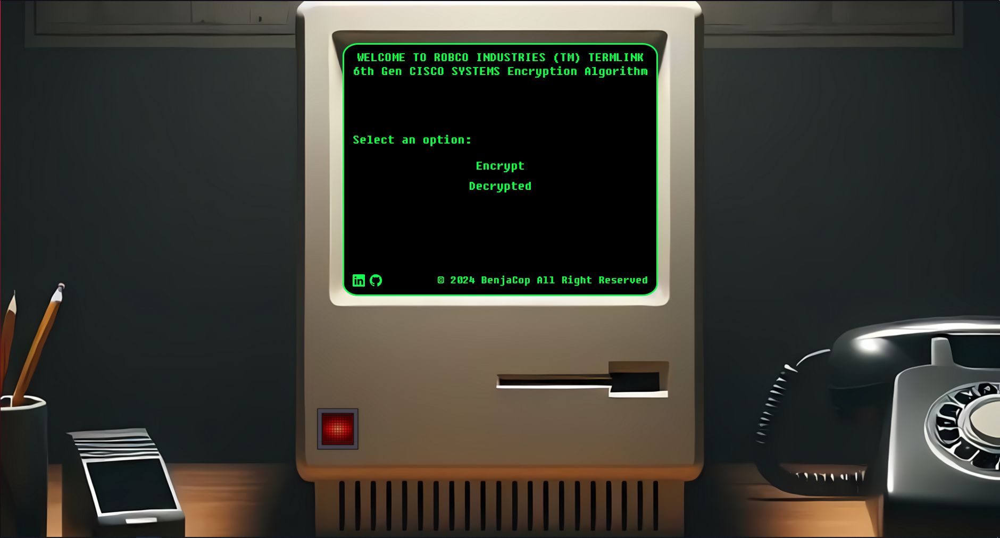
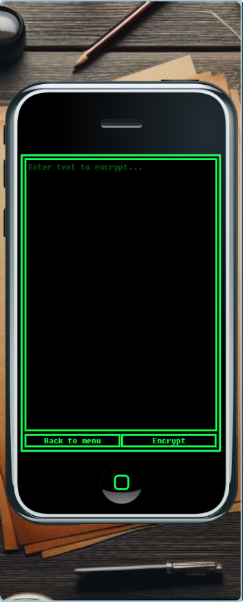

# Vintage Computer Encrypt 💻

Desafio Encriptador de Alura LATAM

El diseño de la pagina esta inspirado en Macintosh Apple, 1er iPhone, Terminal Fallout 3 y Blockade. Se tienen que pulir detalles, arreglar media query, arreglar easter egg...

## Screenshots 📷

